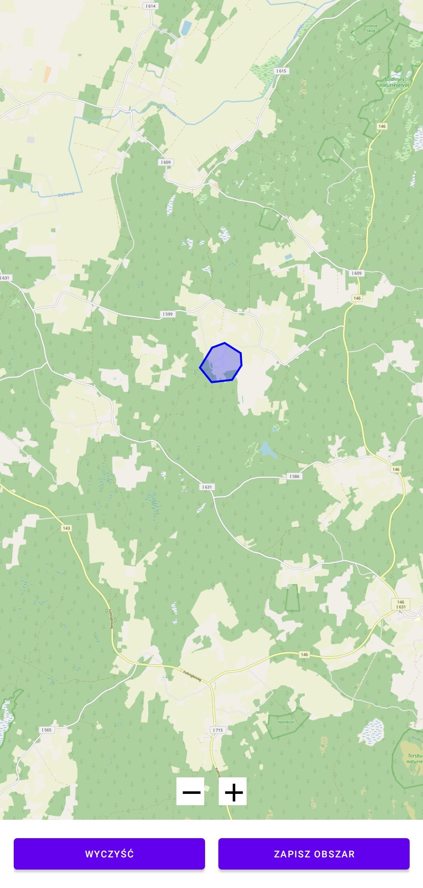
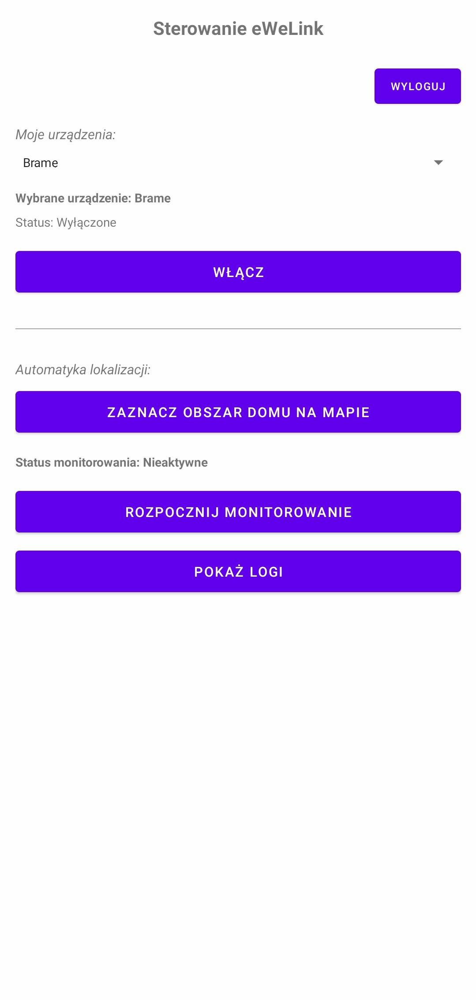
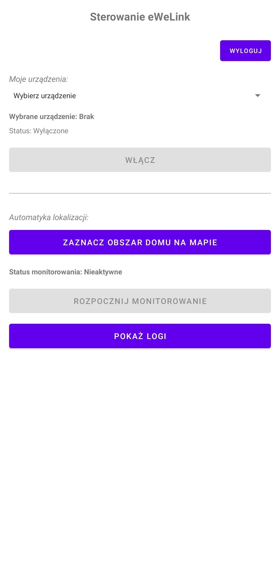

This app allows you to control devices such as the Sonoff Basic Wi-Fi switch via the eWeLink API.

When a user enters a geofence area with a 1500-meter radius, the app starts measuring their precise location. The center of the circle is calculated as the centroid of a polygon.

If the user enters the selected area, a toggle signal is sent to the device (e.g., to open a gate).

    
    
    

ToDo:
- add option to turn gate when user is in area and connects to bluetooth (car audio)
- before turning on device check if state is on
- check if ewelink secret expired and refresh it
- do not fetch devices every time app starts
- prompt user for high accuracy location permission at the start of app

Compilation:
1. Open project in android studio 
2. Create secrets.properties file and paste here your apis like just like in local.defaults.properties file
3. Run
